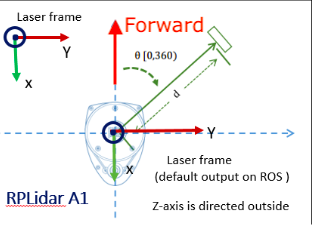
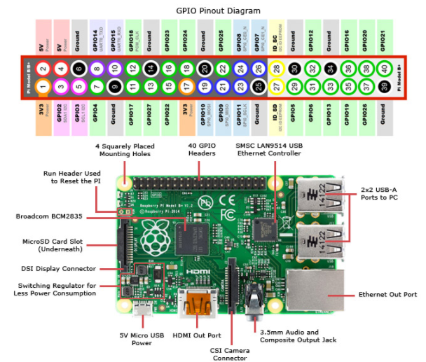

# LiDAR on PiRacer
## Pre-Requisite HW
- PiRacer up and running (should be controlled by Web interface and Gamepad controller) 
  - Make sure the PiRacer has a unique identification name
  - Removed the cooler to make battery pack fit on PiRacer
- LiDAR sensor - should be able to rotate when connected using USB Data cabel to PC/RPi
- USB Data Cable
- Positioning LiDAR sensor
  - Make sure that the front of LiDAR sensor is free from any obstacles.
  - Make sure the LiDAR sensor is not placed too high on the PiRacer (if it is placed high then it won't detect other cars below its horizon level)
  - Make sure the blind spot / dead angle are covered.

## Pre-Requisite SW
- Reference: https://github.com/Roboticia/RPLidar (https://github.com/Roboticia/RPLidar#installing)
- https://docs.donkeycar.com/parts/lidar/
- 
- 
- LiDAR sensor data needs filtering (Guassian filter https://stackoverflow.com/questions/29731726/how-to-calculate-a-gaussian-kernel-matrix-efficiently-in-numpy)
- 